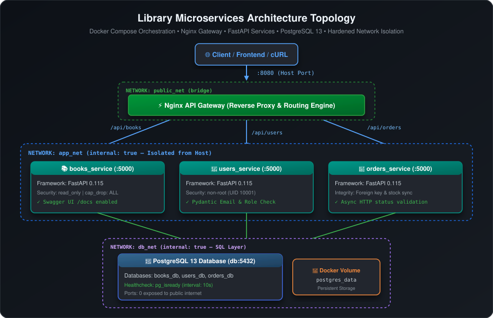
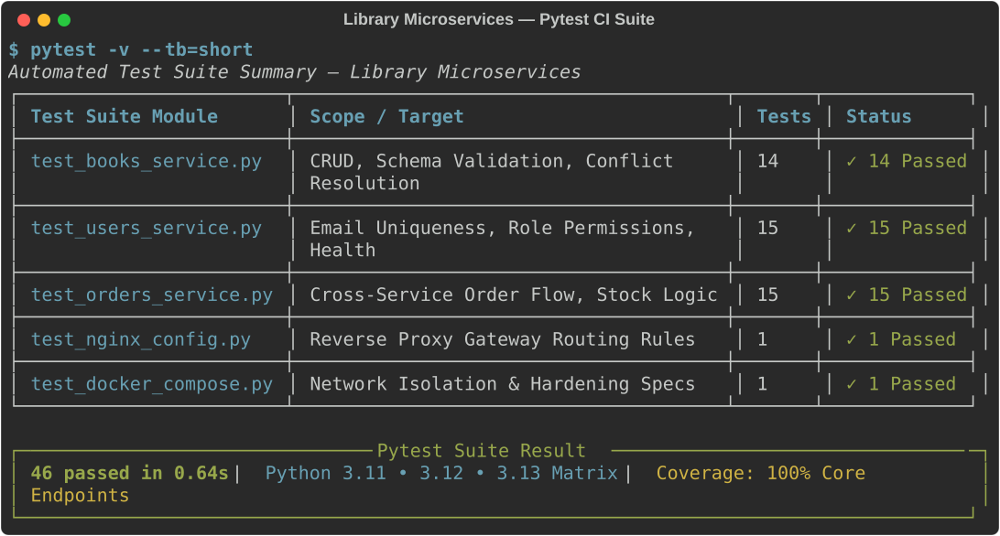

# 🐳 Library Microservices: FastAPI, PostgreSQL & Nginx with Docker Compose

[](https://github.com/aledash3/library-microservices-fastapi/actions)
[](https://www.python.org/)
[](https://fastapi.tiangolo.com/)
[](https://www.postgresql.org/)
[](https://docs.docker.com/compose/)
[](https://nginx.org/)
[](https://docs.pytest.org/)
[](LICENSE)
[](README.es.md)

Academic microservices project featuring FastAPI, PostgreSQL persistence, Nginx API Gateway routing, and isolated Docker Compose networks.

> 🌐 **Language / Idioma:** English | [Leer documentación en Español](README.es.md)

---

## Scope and limitations

This is an academic project. Nginx routes requests to one upstream per service; the current configuration does not demonstrate load balancing across replicas. Services share PostgreSQL, a design tradeoff that simplifies the exercise but couples their data layer. Internal Docker networks and container hardening do not by themselves establish production readiness. Authentication, TLS termination, monitoring, backup/restore and load testing must be evaluated for a real deployment.

CI currently runs on Python 3.11 and 3.12. The workflow and test output are the source of truth; a fixed test-count badge is not a coverage guarantee.

## 📌 Overview

This repository provides a containerized microservices architecture for an academic project for a digital library management system built with **Docker Compose**, **FastAPI**, **PostgreSQL**, and **Nginx**.

The system is composed of three decoupled, domain-driven microservices:

* `books_service`: Comprehensive catalog and book lifecycle management.
* `users_service`: Reader and user directory administration.
* `orders_service`: Book checkout and order tracking linking readers with books.

All services run inside isolated Docker containers connected through private internal networks. The PostgreSQL database is completely shielded from the public host network, while **Nginx** acts as an edge **API Gateway** and reverse proxy, exposing a single HTTP entrypoint to the host.

Key highlights include **full CRUD workflows**, automated **Swagger UI** documentation, persistent data storage via Docker named volumes, hardened container security (`read_only`, `cap_drop: ALL`, non-root execution), a 46-test automated test suite, and a continuous integration (CI) pipeline running across multiple Python versions.

---

## 🎯 Objectives

### General Objective
Design, implement, and orchestrate a secure, modular, and containerized microservices ecosystem using FastAPI, PostgreSQL, Docker Compose, and Nginx as an API Gateway, strictly applying the principle of least privilege, multi-tiered network isolation, and data durability.

### Specific Objectives
* Build three independent, asynchronous RESTful microservices with FastAPI.
* Implement strict data validation and serialization with Pydantic.
* Configure PostgreSQL as a centralized relational datastore with container healthchecks.
* Orchestrate the multi-container fleet declaratively via Docker Compose.
* Configure Nginx as an API Gateway for reverse-proxy routing and header propagation.
* Isolate internal communication channels using restricted Docker bridge networks (`internal: true`).
* Manage sensitive credentials safely using `.env` and `.env.example` templates.
* Enforce container hardening via read-only filesystems, unprivileged users, and kernel capability drops.
* Guarantee software reliability through automated testing with Pytest and GitHub Actions CI.

---

## 🧱 System Architecture

<p align="center">
  
</p>

The architecture follows a microservices pattern with a single perimeter gateway:

```text
Client / Frontend / curl
         │
         ▼  (Port :8080 on host)
┌───────────────────────────────────────┐
│        Nginx API Gateway              │  Network: public_net (bridge)
└──────────────────┬────────────────────┘
                   │
                   ▼  (Internal routing)
┌───────────────────────────────────────┐
│              app_net                  │  Network: app_net (internal: true)
│   ┌──────────────┬────────────────┐   │
│   ▼              ▼                ▼   │
│ Books Service  Users Service   Orders │
│  (:5000)        (:5000)       (:5000) │
└──────────────────┬────────────────────┘
                   │
                   ▼  (SQL Queries)
┌───────────────────────────────────────┐
│              db_net                   │  Network: db_net (internal: true)
│   ┌───────────────────────────────┐   │
│   │   PostgreSQL 13 (db:5432)     │   │
│   │   Volume: postgres_data       │   │
│   └───────────────────────────────┘   │
└───────────────────────────────────────┘
```

* **Single Host Exposure**: Only port `8080` (Nginx) is mapped to the host machine.
* **Network Isolation**: Microservices and the PostgreSQL database do not expose any ports to the host, reducing direct host exposure.
* **Resilience**: Application containers dynamically await PostgreSQL's healthy state before executing initialization routines.

---

## 🗂️ Project Directory Structure

```text
├── .github/
│   └── workflows/
│       └── ci.yml                 # GitHub Actions CI matrix (Python 3.11, 3.12)
├── books_service/
│   ├── .dockerignore              # Docker build context exclusions
│   ├── app.py                     # FastAPI routes, schemas, and DB connection logic
│   ├── Dockerfile                 # Non-root image based on python:3.11-slim
│   └── requirements.txt           # Production dependencies
├── nginx/
│   └── nginx.conf                 # Gateway routing and reverse proxy rules
├── orders_service/
│   ├── .dockerignore
│   ├── app.py
│   ├── Dockerfile
│   └── requirements.txt
├── tests/
│   ├── __init__.py
│   ├── conftest.py                # Test fixtures, TestClient setup, and query mocks
│   ├── test_books_service.py      # Unit and validation tests for Books Service
│   ├── test_docker_compose.py     # Syntax and security validation for Docker Compose
│   ├── test_nginx_config.py       # Configuration and upstream verification for Nginx
│   ├── test_orders_service.py     # Unit and validation tests for Orders Service
│   └── test_users_service.py       # Unit and validation tests for Users Service
├── users_service/
│   ├── .dockerignore
│   ├── app.py
│   ├── Dockerfile
│   └── requirements.txt
├── .env.example                   # Environment variable template
├── .gitignore                     # Git exclusion rules for credentials and build cache
├── docker-compose.yml             # Orchestration for services, networks, and volumes
├── LICENSE                        # MIT License
├── pyproject.toml                 # Tool configuration (Pytest, Ruff, build metadata)
├── README.es.md                   # Spanish Documentation
└── README.md                      # English Documentation
```

---

## 🛠️ Technologies Used

| Technology | Version | System Role |
| :--- | :--- | :--- |
| **Python** | 3.11+ | Backend microservices runtime |
| **FastAPI** | 0.115.0 | High-performance modern ASGI framework for REST APIs |
| **Uvicorn** | 0.30.6+ | Production ASGI web server |
| **PostgreSQL** | 13 | Primary relational datastore |
| **Psycopg2** | 2.9.9 | Native PostgreSQL adapter for Python |
| **Docker** | 24+ | Lightweight container engine |
| **Docker Compose**| v2+ | Declarative multi-container orchestration |
| **Nginx** | 1.25-alpine | Edge API Gateway and reverse proxy |
| **Pytest** | 9.0+ | Automated test suite and coverage reporting |
| **Ruff** | 0.15+ | Blazing-fast Python linter and code quality enforcement |
| **Swagger UI** | Built-in | Interactive OpenAPI documentation browser |

---

## 🧩 Microservices & Endpoint Reference

### 📚 1. Books Service (`/api/books`)

Manages the catalog of books in the library.

* **Payload Schema (`BookCreate` / `BookUpdate`)**:
  ```json
  {
    "title": "One Hundred Years of Solitude",
    "author": "Gabriel García Márquez"
  }
  ```

| Method | Endpoint | Description | Success Code |
| :--- | :--- | :--- | :--- |
| `GET` | `/api/books/` | List all registered books | `200 OK` |
| `GET` | `/api/books/{id}` | Retrieve a specific book by ID | `200 OK` |
| `POST` | `/api/books/` | Create and register a new book | `201 Created` |
| `PUT` | `/api/books/{id}` | Update an existing book's details | `200 OK` |
| `DELETE` | `/api/books/{id}` | Delete a book (validates relational integrity) | `200 OK` |
| `GET` | `/api/books/health` | Health check endpoint | `200 OK` |
| `GET` | `/api/books/docs` | Interactive Swagger UI documentation | `200 OK` |

> [!NOTE]
> Deleting a book referenced by existing orders returns `409 Conflict` to preserve referential integrity.

---

### 👤 2. Users Service (`/api/users`)

Manages user registrations and accounts.

* **Payload Schema (`UserCreate` / `UserUpdate`)**:
  ```json
  {
    "name": "David Cruz",
    "email": "david.cruz@example.com"
  }
  ```

| Method | Endpoint | Description | Success Code |
| :--- | :--- | :--- | :--- |
| `GET` | `/api/users/` | List all registered users | `200 OK` |
| `GET` | `/api/users/{id}` | Retrieve user profile by ID | `200 OK` |
| `POST` | `/api/users/` | Register a new user (enforces unique email) | `201 Created` |
| `PUT` | `/api/users/{id}` | Update user information | `200 OK` |
| `DELETE` | `/api/users/{id}` | Delete a user (validates active orders) | `200 OK` |
| `GET` | `/api/users/health` | Health check endpoint | `200 OK` |
| `GET` | `/api/users/docs` | Interactive Swagger UI documentation | `200 OK` |

> [!IMPORTANT]
> The `email` field is enforced with a database `UNIQUE` constraint and regex pattern validation. Duplicate registrations return `409 Conflict`.

---

### 🧾 3. Orders Service (`/api/orders`)

Coordinates checkout orders, linking users with books.

* **Payload Schema (`OrderCreate` / `OrderUpdate`)**:
  ```json
  {
    "user_id": 1,
    "book_id": 1,
    "quantity": 2
  }
  ```

| Method | Endpoint | Description | Success Code |
| :--- | :--- | :--- | :--- |
| `GET` | `/api/orders/` | List all orders with enriched user and book titles | `200 OK` |
| `GET` | `/api/orders/{id}` | Retrieve full details for a single order | `200 OK` |
| `POST` | `/api/orders/` | Place an order (validates user and book existence) | `201 Created` |
| `PUT` | `/api/orders/{id}` | Modify order parameters | `200 OK` |
| `DELETE` | `/api/orders/{id}` | Cancel and remove an order | `200 OK` |
| `GET` | `/api/orders/health` | Health check endpoint | `200 OK` |
| `GET` | `/api/orders/docs` | Interactive Swagger UI documentation | `200 OK` |

---

## 🌐 Nginx API Gateway

Nginx acts as the single edge point of contact. Requests arriving on port `8080` are inspected and proxied based on their path prefix:

```nginx
upstream books_backend  { server books_service:5000; }
upstream users_backend  { server users_service:5000; }
upstream orders_backend { server orders_service:5000; }

server {
    listen 80;
    server_tokens off;

    location /api/books/  { proxy_pass http://books_backend/;  ... }
    location /api/users/  { proxy_pass http://users_backend/;  ... }
    location /api/orders/ { proxy_pass http://orders_backend/; ... }
}
```

* **Version Masking**: `server_tokens off;` prevents Nginx from broadcasting its version in HTTP response headers.
* **Prefix Forwarding**: The `X-Forwarded-Prefix` header guarantees that Swagger UI correctly resolves OpenAPI specification URLs behind the gateway.

---

## 🧪 Interactive API Documentation (Swagger UI)

Each service provides interactive OpenAPI documentation:

* **Books**: `http://localhost:8080/api/books/docs`
* **Users**: `http://localhost:8080/api/users/docs`
* **Orders**: `http://localhost:8080/api/orders/docs`

You can explore schemas and trigger live HTTP requests directly from your browser.

---

## ⚙️ Prerequisites

* **Docker Engine** 24.0 or higher.
* **Docker Compose** v2 or higher.
* **Git** for cloning the repository.
* Optional (for local non-Docker development): **Python 3.11+**.

---

## 🚀 Quick Start & Deployment

### 1. Clone the Repository
```bash
git clone https://github.com/aledash3/library-microservices-fastapi.git
cd library-microservices-fastapi
```

### 2. Configure Environment Variables
Copy the template `.env.example` to `.env`:
```bash
cp .env.example .env
```

Reference `.env` content:
```env
POSTGRES_DB=library_db
POSTGRES_USER=library_user
POSTGRES_PASSWORD=library_password_secure123

DB_HOST=db
DB_PORT=5432

NGINX_HOST_PORT=8080
```

### 3. Build and Start the Cluster
```bash
docker compose up --build -d
```

### 4. Verify Container Health
```bash
docker compose ps
```

Expected output (all containers `Up` and `db` in `healthy` status):
```text
NAME                                  STATUS                    PORTS
biblioteca-db-1                       Up (healthy)              5432/tcp
biblioteca-books_service-1            Up                        5000/tcp
biblioteca-users_service-1            Up                        5000/tcp
biblioteca-orders_service-1           Up                        5000/tcp
biblioteca-nginx-1                    Up                        0.0.0.0:8080->80/tcp
```

---

## 🔬 Testing with `curl`

### Health Check Verifications
```bash
curl http://localhost:8080/api/books/health
curl http://localhost:8080/api/users/health
curl http://localhost:8080/api/orders/health
```

### End-to-End CRUD Workflow

#### 1. Register a User
```bash
curl -i -X POST http://localhost:8080/api/users/ \
  -H "Content-Type: application/json" \
  -d '{"name":"David Cruz","email":"david.cruz@example.com"}'
```

#### 2. Create a Book
```bash
curl -i -X POST http://localhost:8080/api/books/ \
  -H "Content-Type: application/json" \
  -d '{"title":"The Little Prince","author":"Antoine de Saint-Exupéry"}'
```

#### 3. Place an Order
```bash
curl -i -X POST http://localhost:8080/api/orders/ \
  -H "Content-Type: application/json" \
  -d '{"user_id":1,"book_id":1,"quantity":2}'
```

#### 4. Query Order with Cross-Service Details
```bash
curl http://localhost:8080/api/orders/1
```

Returned payload:
```json
{
  "id": 1,
  "user_id": 1,
  "user_name": "David Cruz",
  "book_id": 1,
  "book_title": "The Little Prince",
  "quantity": 2,
  "created_at": "2026-06-22 18:00:00"
}
```

#### 5. Verify Conflict Protection
```bash
curl -i -X DELETE http://localhost:8080/api/books/1
```
> Returns HTTP `409 Conflict` with `"No se puede eliminar el libro porque tiene órdenes asociadas"`.

#### 6. Clean Up Order and Book
```bash
curl -i -X DELETE http://localhost:8080/api/orders/1
curl -i -X DELETE http://localhost:8080/api/books/1
```
> Both return HTTP `200 OK`.

---

## 🗄️ Direct PostgreSQL Inspection

To interactively inspect database tables inside the running container:
```bash
docker compose exec db psql -U library_user -d library_db
```

Useful SQL commands:
```sql
-- List tables
\dt

-- Query rows
SELECT * FROM books;
SELECT * FROM users;
SELECT * FROM orders;

-- Exit psql
\q
```

---

## 🛡️ Security & DevOps Best Practices

* **Principle of Least Privilege**: Application containers create and run under an unprivileged user (`appuser`).
* **Container Hardening**:
  * `read_only: true`: Containers mount root filesystems in read-only mode.
  * `cap_drop: - ALL`: Drops all Linux kernel capabilities.
  * `security_opt: - no-new-privileges:true`: Prevents privilege escalation via SUID binaries.
  * `tmpfs: - /tmp`: Uses temporary in-memory RAM filesystems for ephemeral data.
* **Network Segmentation (`internal: true`)**:
  * `public_net`: Public bridge connecting Nginx to the host.
  * `app_net`: Isolated internal network connecting Nginx to FastAPI services.
  * `db_net`: Isolated internal network connecting microservices to PostgreSQL.
* **Data Durability**: Named Docker volume `postgres_data` ensures database persistence across teardowns.
* **Secret Protection**: No passwords or sensitive keys are committed to Git; `.env` is ignored by `.gitignore`.

---

## 🧪 Automated Testing & Continuous Integration (CI)

<p align="center">
  
</p>

The repository includes an extensive suite of **46 unit and integration tests** verifying:
* Endpoint availability and HTTP response contracts.
* Pydantic schema constraints and validation errors.
* Database connection retry mechanics and healthchecks.
* Cross-service relational conflict detection (409 checks).
* Declarative consistency of `docker-compose.yml` and Nginx rules.

### Running Tests Locally
```bash
# Install test dependencies
pip install pytest pytest-cov ruff pyyaml httpx

# Run tests with code coverage analysis
pytest --cov=. --cov-report=term-missing

# Run code linter
ruff check .
```

### GitHub Actions CI Workflow
Every push and pull request to `main` executes the automated CI pipeline across **Python 3.11 and 3.12** on Ubuntu runners.

---

## 🧰 Maintenance Commands

```bash
# View real-time cluster logs
docker compose logs -f

# View logs for a specific service
docker compose logs -f books_service

# Stop cluster preserving PostgreSQL data
docker compose down

# Stop cluster and reset database
docker compose down -v

# Force clean rebuild
docker compose up --build --force-recreate -d
```

---

## 👨‍💻 Author

**David Alejandro Cruz Palacios**
Computer Science Engineering Student — Universidad Politécnica Salesiana
GitHub: [@aledash3](https://github.com/aledash3)
Course: Distributed Systems (6th Semester)

---

## 📄 License

This project is licensed under the [MIT License](LICENSE).
